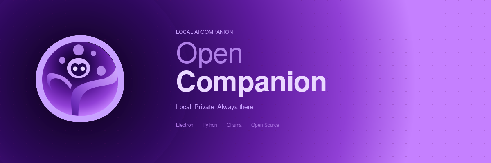
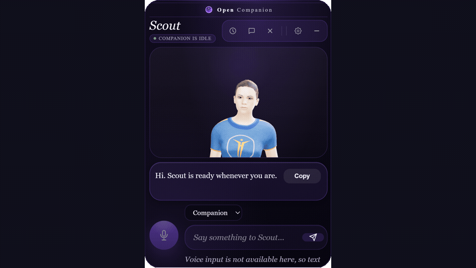

# OpenCompanion

[](https://discord.gg/fXS9QgqRBb)



OpenCompanion is an open-source, local-first Windows desktop companion harness for AI models, tools, memory, and practical workflows.

It is built with Electron, Node.js, and Python. Local Ollama models are the default path, while cloud providers are optional and only used when the user explicitly configures API access.



This repository is a clean public source release. It does not include private runtime data, local memories, active soul files, API keys, downloaded models, or developer machine state.

## Current Status

OpenCompanion is in early alpha.

The app is usable for development and local testing, but the public repo, setup flow, UI polish, and packaging are still being cleaned up. Expect rough edges, missing polish, and breaking changes.

## What It Does

- Runs a desktop AI companion shell on Windows.
- Uses local Ollama models by default.
- Allows optional cloud provider configuration when the user chooses it.
- Provides companion-style conversations, memory modes, voice setup, and local workflow tools.
- Keeps runtime profile state, memories, vault content, generated assets, and private configuration outside the public source tree.
- Focuses on user control, visible behavior, and practical desktop workflows instead of hidden automation.

## What It Is Not

- Not a polished consumer release yet.
- Not a hosted cloud service.
- Not a medical, legal, or financial assistant.
- Not designed to run unrestricted host actions silently.
- Not a paid app or paywalled product.

## Requirements

- Windows
- Node.js and npm
- Python 3
- Ollama, for local model use

Some runtime assets, such as Kokoro and Whisper assets, are downloaded or prepared by the app setup flow and are intentionally not committed to the repo.

## Quick Start

```bash
npm install
python -m pip install -r requirements.txt
npm start
```

The app starts the Electron shell. On first launch, the setup wizard helps configure the local or cloud brain provider, memory mode, and voice.

## Configuration

Shared defaults live in:

```text
config/defaults.js
```

User-facing settings option catalogs live in:

```text
app/shared/settings-options.js
```

Runtime config is loaded from profile config files and merged with the defaults.

Keep private overrides, API keys, generated runtime assets, memories, vault contents, local profile state, logs, and machine-specific paths out of git.

`.env.example` only documents the optional ChatGPT OAuth public client override. Most users and contributors do not need a `.env` file.

## Common Commands

```bash
npm test
npm run test:settings-ui
npm run generate-notices
npm run generate-voices
npm run capture-readme-gif
npm run pack:win
```

The broader Python/Electron suites can take longer:

```bash
python app/tests/test_suite.py
npm run test:full
```

`python app/tests/test_suite.py` can temporarily rewrite live runtime files. Do not run it beside the live app.

## Documentation

- `docs/HANDOFF.md` tracks the current cleanup state, verified commands, and next steps.
- `docs/ARCHITECTURE.md` describes the live runtime, configuration shape, and safety boundaries.
- `AGENTS.md` contains repo guidance for coding agents.
- `CLAUDE.md` contains Claude Code-specific entry guidance and should stay aligned with `AGENTS.md`.

## Security And Privacy

OpenCompanion is intended to be local-first:

- Local Ollama is the default model path.
- Cloud APIs are opt-in.
- API keys should live in the OS keychain or local ignored config, never in committed files.
- Runtime memories, vault content, generated caches, test artifacts, downloaded models, and profile state are ignored.
- Host/system actions should stay explicit and approval-gated where appropriate.

Do not commit private conversations, local profile data, API keys, generated runtime assets, machine-specific paths, logs, downloaded models, memory, vault contents, or active soul data.

## Support

OpenCompanion is free and open source.

If the project helps you, you can optionally support development with a small tip or supporter token.

[Support OpenCompanion](https://buy.stripe.com/fZu00i2Jp9TxgMLboY0Ny00)

Support is voluntary and does not unlock exclusive features, custom services, physical goods, financial returns, or charity/nonprofit benefits.

## Contact

Developer: Kacper Nowicki / flurris

- Links: https://linktr.ee/flurris
- Discord: https://discord.gg/fXS9QgqRBb

## Third-Party Licenses

OpenCompanion is MIT licensed. Third-party notices are tracked in:

```text
THIRD_PARTY_NOTICES.md
THIRD_PARTY_NODE_DEPENDENCIES.md
```

The bundled avatar assets are documented as CC0 TalkingHead/MPFB example assets. Voice previews are generated from public Kokoro assets and are included for app functionality.
